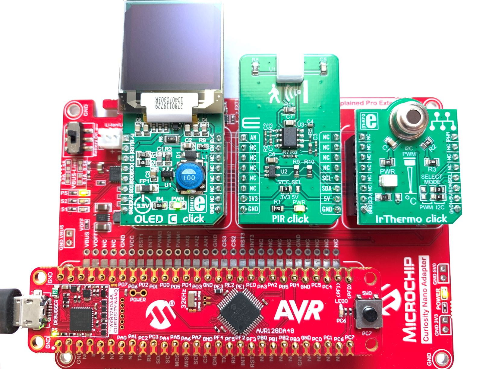
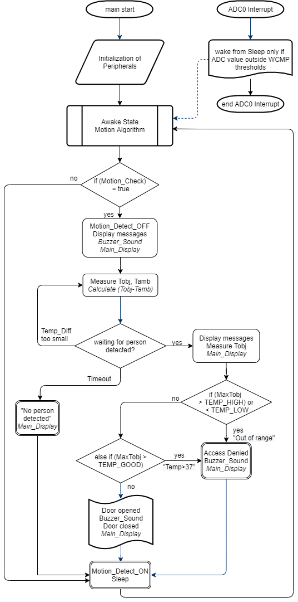
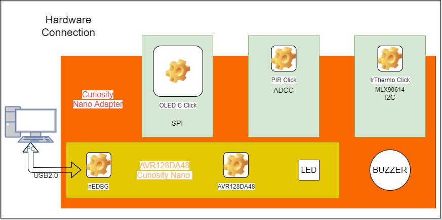
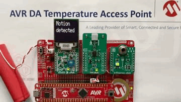

 <article class="markdown-body entry-content p-3 p-md-6" itemprop="This needs to locked down and 'never' changed">

# Temperature Access Point using AVR® DA microcontroller

This repository contains examples of Temperature Access Point with motion detection, contactless temperature ir auto-scanning features using AVR® DA microcontroller from Microchip.

## Related Documentation
More details and code examples on the AVR128DA48 can be found at the following links:
- [TB3245 - Using 12-Bit ADC for Conversions, Accumulation, and Triggering Events](http://www.microchip.com/wwwappnotes/appnotes.aspx?appnote=en1001530)
- [AVR128DA48 Product Page](https://www.microchip.com/wwwproducts/en/AVR128DA48)
- [AVR128DA48 Code Examples on GitHub](https://github.com/microchip-pic-avr-examples?q=avr128da48)
- [AVR128DA48 Project Examples in START](https://start.atmel.com/#examples/AVR128DA48CuriosityNano)

## Software Used
- MPLAB X IDE v5.40 [(https://www.microchip.com/mplab/mplab-x-ide)](https://www.microchip.com/mplab/mplab-x-ide)
- XC8 v2.20 [(https://www.microchip.com/mplab/compilers)](https://www.microchip.com/mplab/compilers)
- MCC v3.95.0 [(https://www.microchip.com/mplab/mplab-code-configurator)](https://www.microchip.com/mplab/mplab-code-configurator)
- AVR-Dx_DFP 1.3.65 (Install from MPLAB X IDE -> Tools -> Packs )
- 8-bit AVR MCUs Lib version 2.3.0 

## Hardware Used
- AVR128DA48 Curiosity Nano [(DM164151)](https://www.microchip.com/Developmenttools/ProductDetails/DM164151)
- Curiosity Nano Base for Click Boards [(AC164162)](https://www.microchip.com/Developmenttools/ProductDetails/AC164162)
- OLED C click board [(MIKROE-1585)](https://www.mikroe.com/oled-c-click)
- PIR click board [(MIKROE-3339)](https://www.mikroe.com/pir-click)
- IrThermo click 3.3V board [(MIKROE-1361)](https://www.mikroe.com/irthermo-33v-click)

## Setup

The AVR128DA48 Curiosity Nano Development Board is used as test platform, inserted into the Curiosity Nano Base for Click Boards [(AC164162)](https://www.microchip.com/Developmenttools/ProductDetails/AC164162)
Two setups will be used for the use cases described in this document:

  - **The Hardware Configuration** uses OLED C click, PIR click, and IrThermo click, inserted in mikroBUS slots pin of Curiosity Nano Adapter along side with AVR128DA48 Curiosity Nano, like in the picture below:
 

 The following pin configurations must be made for this project:

|Pin           | Configuration          |
| :----------: | :----------------:     |
|PD4 (AIN4)    | Analog Input ADC0 (PIR)|
|PC2 (SDA)     | Digital TWI0 i2c       |
|PC3 (SCL)     | Digital TWI0 i2c       |
|PB4 (TCD0)    | Digital Output Buzzer  |
|PB5 (TCD0)    | Digital Output Buzzer  |
|PA4 (MOSI)    | Digital Output SPI     |
|PA5 (MISO)    | Digital Input SPI      |
|PA6 (SCK)     | Digital Output SPI     |
|PA7 (nCS)     | Digital Output OLED    |
|PD0 (DC)      | Digital Output OLED    |
|PD3 (RW)      | Digital Output OLED    |
|PD6 (EN)      | Digital Output OLED    |
|PD7 (RST)     | Digital Output OLED    |
|PC6 (LED0)    | Digital Output DOOR    |

## Operation

### Project Description
This project describes the usage of the AVR DA microcontroller as the heart of the Temperature Auto-Scanning Door Access.
The purpose is to detect a person using a PIR sensor and then measure its temperature using IR contactless thermo-scanner.  
The ADC peripheral is used to read the PIR Click board, and trigger from sleep the CPU, only if the ADC value is Outside the Window Comparator Threshold. 
Then the OLED C Click board is used to Display the information to the User that needs to get a temperature measurement using the contactless temperature sensor 
on IR-Thermo click 3.3V board. The ADC will wake from sleep the microcontroller and then compare the (Tobj-Tamb) temperature with a predefined value and if above 
it will start measure again the User temp. and display it on the OLED screen. The Piezo buzzer is used to alert the user of the specific action, using 4 different beep sounds.
The flow diagram is presented in the picture below:

 

### Demo Operation
1. Connect the board to the PC/Laptop/Mac with a micro-USB cable, like in the diagram below:
 
2. Open MPLAB X and load the project avr128da48-temp-ir-auto-scanning.X
3. Clean and Build Project, then Make and Program the AVR128DA48 Curiosity Nano.
4. After programming, the OLED screen should light up with the message: "Motion detected" 
5. Follow the steps provided by the display to measure the temperature, contactless, as in the animation below:
     

## Summary
This example provides a method for using the The AVR® DA family of microcontrollers as an Temperature access point with auto-scanning and low power functions.
AVR® DA will detect moving persons nearby and invite them to measure their temperature contactless, showing the result on the OLED display.
The hardware setup can be powered by a single Lithium battery and because of the low power consumption, it will last for many hours.